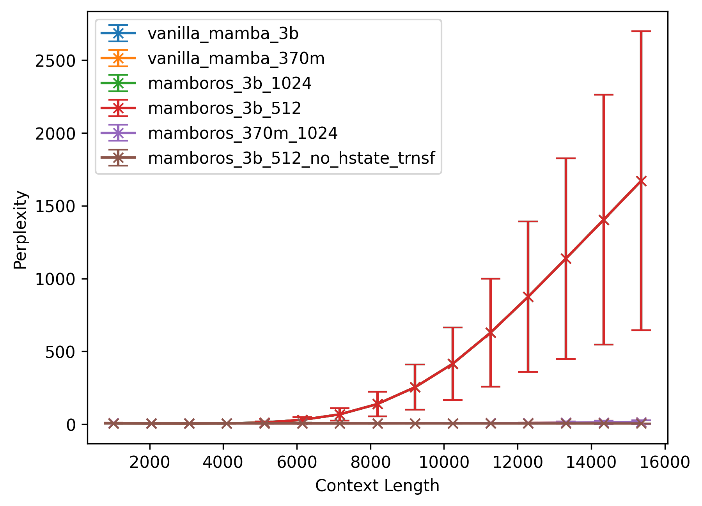

<div align="center">

</div>

# Mamboros

Transfer hidden state of previous Mamba computation as initial hidden state to next computation.
Inspired by [long-mamba repo](https://github.com/jzhang38/LongMamba).

**Advantages**

* Reduces memory footprint: Instead of 16k token computation, 2x 8k token computations + hidden state transfer
* Enables longer context length (potentially infinite context length?)
* Enables larger model
* Enables larger batch-size
* Also enables saving and restoring model state for in-context learning

**Notes**

* Mamboros concept does not make sense for autoregressive text generation, as in this case only a single token
  would be generated in all layers before the next would be generated; Mamba already uses previous 
  hidden-state in this case.
* Mamboros should work great for processing the initial (very large) context.
* Mamboros could be used during training to learn longer context lengths. However, backpropagation would only 
  be performed till initial hidden state (operational-context-length, not pseudo-context-length). We have to check 
  how well it works.


## Implementation / Usage

* Mamboros implementation in [branch mamboros of nsmlzl/mamba repo](https://github.com/nsmlzl/mamba/tree/mamboros).
* Necessary changes are in causal-conv1d and selective-scan kernel. As well as in Mamba pytorch module.
* Pytests for [causal-conv1d](https://github.com/nsmlzl/mamba/blob/mamboros/tests/test_causal_conv1d.py)
  and [selective-scan](https://github.com/nsmlzl/mamba/blob/8032c14ca1a9b139ba5471a0f18a80072d0437ee/tests/ops/test_selective_scan.py#L149-L252)
  demonstrate the same output for forward path.
  The pytests for causal-conv1d also generate the same output for the backward path. The selective-scan pytests
  requires an additional hidden state gradient to be passed backward as well to generate the same results.
* **Important:** Changes are only implemented in the slow path of Mamba block.

**Usage**

Configure mamba as normal. Deactivate `use_fast_path` and set `max_hstate_trnsf_cnt` to the number of hidden state
transfers. For instance, for pseudo-context-length of 4096, and operational-context-length of 1024, set it to 3
(hidden state needs to be transferred three times).

```
ssm_cfg = {'max_hstate_trnsf_cnt': hstate_trnsf_cnt, 'use_fast_path': False}

mamba_config = MambaConfig(n_layer=64, d_model=2560, vocab_size=50280,
        ssm_cfg=ssm_cfg, rms_norm=True, residual_in_fp32=True, fused_add_norm=True,
        pad_vocab_size_multiple=1)

model = MambaLMHeadModel(mamba_config).to("cuda")
```

During context processing, ensure that hidden state transfers occur at the correct moment.


## Analysis

### Context Length vs Perplexity (`mamboros_eval.py`)

First, we analyse context length vs perplexity (similar to [long-mamba](https://github.com/jzhang38/LongMamba))
For this we use the pre-trained 2.8B and 370M mamba models from huggingface ([link](https://huggingface.co/state-spaces)).
Perplexity on Next-Token-Prediction is computed over 50 predictions from
'PY007/tokenized\_proof\_pile\_test\_neox'. Mamboros has an operational-context-length of 512 or 1024, while its
pseude-context-length (x-axis) is set to the respective context length; the corresponding Mamba models use
the pseudo-context-length as their operational-context-length.

<div align="center">

</div>

As long-mamba demonstrated, the perplexity and its standard deviation increases for longer context lengths.
This is (probably) caused by the pre-training being performed on a context length of 2k tokens.
Furthermore, we can also reproduce that the smaller mamba model generalizes better for longer context lengths.

Our analysis demonstrates that Mamboros (both 512 and 1024 operational-context-length) performs comparable to
vanilla-mamba (mean perplexity and standard deviation are very similar). The logits are slightly
different. The precision should be sufficient as the cross-entropy between the logits of vanilla-mamba
and mamboros seems to be smaller than that to the target tensor (4k pseudo-context-length: cross-entropy mamboros
to vanilla-mamba 1.46, cross-entropy mamboros to target 1.47; 15k pseudo-context-length: cross-entropy mamboros
to vanilla-mamba 3.16, cross-entropy mamboros to target 7.25). The GPU memory usage of mamboros 2.8B with
1k operational-context-length is 11.6GB (pseudo-context-length has no impact). Mamba requires for 15k
context length 16.7GB GPU memory.

Mamboros without hidden-state transfer performs best, since it is just performing 1k context length NTP
(optimal for pre-trained model). Furthermore, this benchmark does actually not require any long-context
memoryzation.

*Summary:* Mamboros seems to perform comparable to Mamba. Current bottleneck is pre-trained model, which
only works for context-lengths of less than 6k tokens.


### Future

* Fine-tune model for longer pseudo-context-lengths to enable actual utilization for long-context-lengths
* Test with needle-in-haystack benchmark
